[toc]


# 0625

https://www.youtube.com/watch?v=lqjOqeVzzsc&list=PLumVmq_uRGHgBrimIp2-7MCnoPUskVMnd&index=3

- startspring.io 로 시작하기
- gradle open한 후 open as project 클릭


## 라이브러리 살펴보기

- Gradle은 의존관계가 있는 라이브러리를 함께 다운로드 한다.

  

  - **스프링 부트 라이브러리**
    - spring-boot-starter-web
      - spring-boot-starter-tomcat 톰캣(웹서버)
      - spring-webmvc 스프링 웹 MVC
    - spring-boot-starter-thymeleaf - 타임리프 템플릿 엔진(View)
    - spring-boot-starter(공통) 스프링부트 + 스프링코어+ 로깅
      - spirng boot
        - spring core
      - spring-boot-starter-logging
        - lockback slf4j
  - **테스트 라이브러리**
    - spring-boot-start-test
      - junit: 테스트 프레임워크
      - mockito: 목 라이브러리
      - assertj: 테스트 코드를 좀 더 편하게 작성하게 도와주는 라이브러리
      - spring-test: 스프링 통합 테스트 지원

## View 환경 설정

### Welcome Page 만들기

resources/static/index.html

```html
<!doctype html>
<html lang="en">
<head>
    <meta charset="UTF-8">
    <meta name="viewport"
          content="width=device-width, user-scalable=no, initial-scale=1.0, maximum-scale=1.0, minimum-scale=1.0">
    <meta http-equiv="X-UA-Compatible" content="ie=edge">
    <title>hello world</title>
</head>
<body>
Hello
<a href="/hello">hello</a>
</body>
</html>
```


- **스프링 boot가 제공하는 Welcome Page 기능**

- `static/index.html` 을 올려두면 Welcome Page 기능을 제공한다

- https://docs.spring.io/spring-boot/docs/current/reference/html/index.html

  

- **thymeleaf 템플릿 엔진**
- thymleaf 공식사이트
  - https://www.thymeleaf.org/
- 스프링 공식 튜토리얼
- 


### 실습

- static에 index.html 작성해보고 실행하기
- java/hello.hellospring에 
  - controller 패키지 만들기
    - HelloController 클래스 만들기

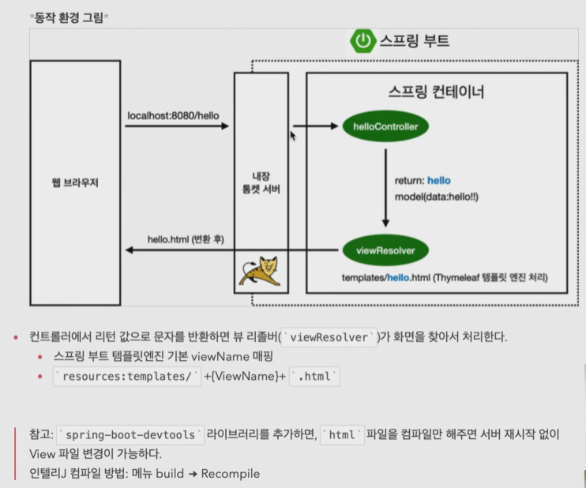

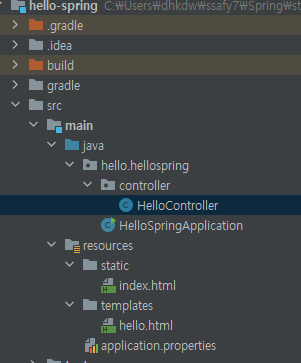

```java
//main/java/hello.hellospirng/controller/HelloController.java

package hello.hellospring.controller;

import org.springframework.stereotype.Controller;
import org.springframework.web.bind.annotation.GetMapping;
import org.springframework.ui.Model;

@Controller
public class HelloController {

    @GetMapping("hello") //get방식임 hello페이지 들어가면 이게 호출됨
    public String hello(Model model){
        model.addAttribute("data","hello!");
        return "hello"; //이 헬로를 클릭하면 아래와 같음 hello를 렌더링 시켜라
        
    }
}

```

```html
//resources/templates/hello.html

<!doctype html>
<html xmlns:th="http://www.tymeleaf.org">
<head>
    <title>Document</title>
    <meta http-equiv="Content-type" content="text/html; charset=UTF-8"/>
</head>
<body>
<p th:text="'안녕하세요. ' + ${data}">안녕하세요 손님</p>
</body>
</html>
```


# 0627

## 빌드하고 실행하기

### 콘솔로 이동

1. ./gradlew build
2. cd build/libs
3. java -jar hello-spring-0.01-SNAPSHOT.jar
4. 실행확인

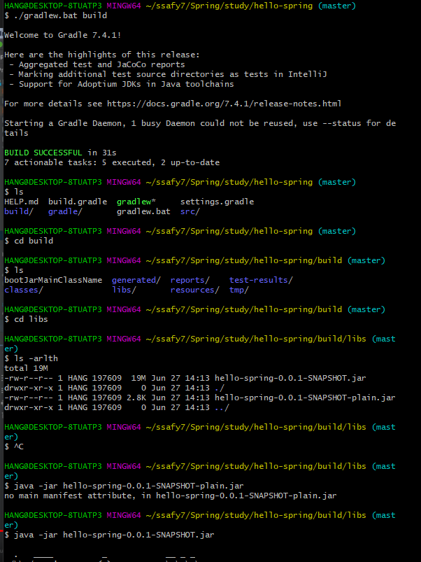


## 스프링 웹 개발 기초

- 정적컨텐츠
- MVC와 템플릿 엔진
- API


## 정적 컨텐츠

- 스프링 부트 정적 컨텐츠 기능
- static 하위 폴더에 hello-static.html 작성
- localhost:8080/hello-static.html 입장 가능

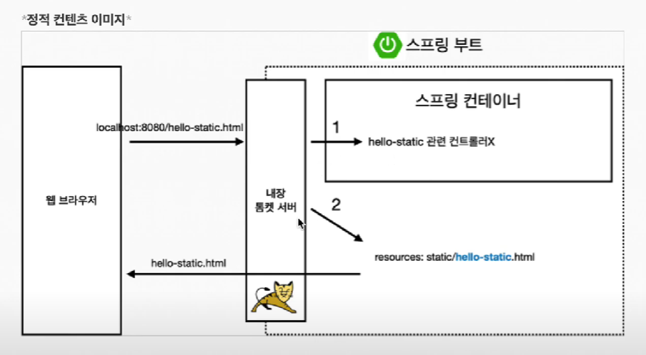


## MVC와 템플릿 엔진

- MVC : Model, View, Controller

### Controller

```java
@Controller
public class HelloController {

    @GetMapping("hello") //hello 가 들어오면 이것이 실행됨
    public String hello(Model model){
        model.addAttribute("data","hello!");
        return "hello";
    }
}

```

- 내부적인 로직에 집중

### View

`resources/remplate/hello-template.hmtl`

```html
<!doctype html>
<html xmlns:th="http://www.tymeleaf.org">
<head>
    <title>Document</title>
    <meta http-equiv="Content-type" content="text/html; charset=UTF-8"/>
</head>
<body>
<p th:text="'안녕하세요. ' + ${data}">안녕하세요 손님</p>
</body>
</html>
```

- view는 화면을 그리는데 모든 역량을 집중해야함


- tymleaf 템플릿의 장점은 서버없어도 html 파일 자체를 열어볼 수 있음 

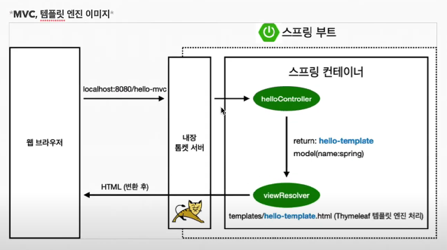


## API

### `@ResponseBody 문자반환`

```java
@GetMapping("hello-api")
    @ResponseBody
    public Hello helloApi(@RequestParam("name") String name){
        Hello hello = new Hello();
        hello.setName(name);
        return hello;

    }
    static class Hello{
        private String name;

        public String getName(){
            return name;
        }
        public void setName(String name){
            this.name = name;
        }
    }
```

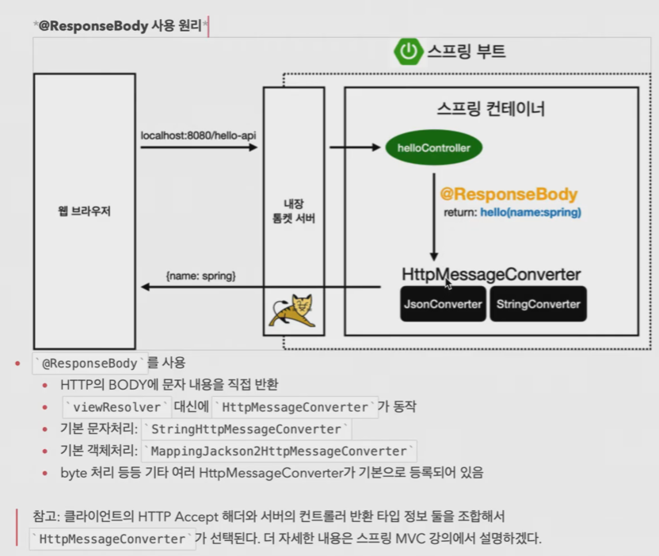


# 0628

## 08비즈니스 요구사항 정리

### 회원 관리 예제 - 백엔드 개발

- 비즈니스 요구사항정리
- 회원 도메인과 리포지토리 만들기
- 회원 리포지토리 테스트 케이스 작성
- 회원 서비스 개발
- 회원 서비스 테스트


- 비즈니스 요구사항 정리
  - 데이터, 회원 ID, 이름
  - 기능, 회원 등록, 조회
  - 아직 데이터 저장소가 선정되지 않음(가상의 시나리오)


- 일반적인 웹 애플리케이션 계층 구조:

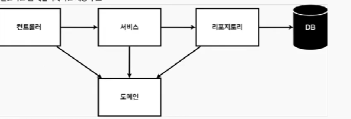

- 컨트롤러 : 웹 MVC의 컨트롤러 역할	
- 서비스 : 핵심 비즈니스 로직 구현
- 리포지토리 : 데이터베이스에 접근, 도메인 객체를 DB에 저장하고 관리
- 도메인 : 비즈니스 도메인 객체 예)회원, 주문, 쿠폰 등등 주로 데이터베이스에 저장하고 관리됨


- 클래스 의존관계

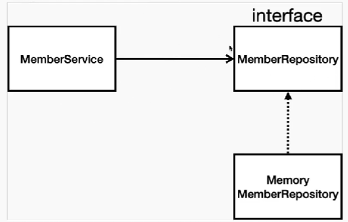

- 아직 데이터 저장소가 선정되지 않아서, 우선 인터페이스로 구현 클래스를 변경할 수 있도록 설계
- 데이터 저장소는 RDB, NoSQL등 다양한 저장소를 고민중인 상황으로 가정
- 개발을 진행하기 위해서 초기 개발 단계에서는 구현체로 가벼운 메모리 기반의 데이터 저장소 사용


## 09 회원 도메인과 리포지토리 만들기

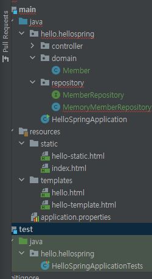

- 레포지토리 패키지 작성
  - 하위 implements 작성
  - 하위 클래스 작성

```java
//repository/MemberRepository

package hello.hellospring.repository;

import hello.hellospring.domain.Member;

import java.util.List;
import java.util.Optional;

public interface MemberRepository {
    Member save(Member member);
    Optional<Member> findById(Long id);
    Optional<Member> findByName(String name);
    List<Member> findAll();
}

```

```java
//repository/MemoryMemberRepository

package hello.hellospring.repository;

import hello.hellospring.domain.Member;

import java.util.*;

public class MemoryMemberRepository implements MemberRepository {

    private static Map<Long, Member> store = new HashMap<>();
    private static long squence = 0L;


    @Override
    public Member save(Member member) {
        member.setId(++squence);
        store.put(member.getId(), member);
        return member;
    }

    @Override
    public Optional<Member> findById(Long id) {
        return Optional.ofNullable(store.get(id));
    }

    @Override
    public Optional<Member> findByName(String name) {
        return store.values().stream().filter(member -> member.getName().equals(name)).findAny();
        //루프돌려서 같은 이름인거 찾음 없으면 null 반환

    }

    @Override
    public List<Member> findAll() {
        return new ArrayList<>(store.values());
    }
}
```


## 10 회원 도메인과 레포지토리 테스트

### 회원레포지토리 테스트 케이스 작성

- 개발한 기능을 테스트 할 때 main 메서드를 통해서 실행하거나, 웹 애플리케이션의 컨트롤러를 통해서 해당 기능을 실행한다. 이러한 방법은 준비하고 실행하는데 오래 걸리고, 반복 실행하기 어렵고 여러 테스트를 한번에 실행하기 어렵다는 단점이 있다. 자바는 JUnit이라는 프레임워크로 테스트를 실행해서 이러한 문제를 해결한다.


### 회원 레포지토리 구현체 테스트

- `src/test/java` 하위 폴더에 생성한다.

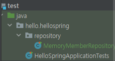

- art+enter누르면 해당 기능에 대한 소스를 임포트함


## 11회원 서비스 개발

```java
//MemberServices

package hello.hellospring.service;

import hello.hellospring.domain.Member;
import hello.hellospring.repository.MemberRepository;
import hello.hellospring.repository.MemoryMemberRepository;

import java.util.List;
import java.util.Optional;

public class MemberService {


    private final MemberRepository memberRepository = new MemoryMemberRepository();

    /**회원 가입**/
    public Long join(Member member){
        //중복회원 x
//        Optional<Member> result = memberRepository.findByName(member.getName());
//
//
//        result.ifPresent(m -> {
//            throw new IllegalStateException("이미 존재하는 회원입니다.")
//        }); 이런식으로도 가능
        validateDuplicateMember(member); //중복회원 검증
        memberRepository.save(member);
        return member.getId();
    }

    private void validateDuplicateMember(Member member) {
        memberRepository.findByName(member.getName())
            .ifPresent(m -> {
                throw new IllegalStateException("이미 존재하는 회원입니다.");
            });
    }
    /**전체회원 조회**/
    public List<Member> findMembers(){
        return memberRepository.findAll();
    }
    public Optional<Member> findOne(Long memberId){
        return memberRepository.findById(memberId);
    }


}

```


# 0629


## 12회원 서비스 테스트

- `ctrl + shift + t`
- 테스트를 자동으로 만들어줌 


- 중복회원 테스트케이스 하다보니 
- `Expected java.lang.IllegalStateException to be thrown, but nothing was thrown`
- 오류가 났다. 구글링해보니 이는 예외가 발생하지 않아서 생긴 문제였다.
- member2 = 'spring' member1 = 'spiring' 이여서 중복되지 않았으므로 예외가 발생하지 않았었다. 


- 같은 레포지토리를 사용하기 위해서

```java
public class MemberService {


//    private final MemberRepository memberRepository = new MemoryMemberRepository();
    private final MemberRepository memberRepository;

    public MemberService(MemberRepository memberRepository){
        this.memberRepository = memberRepository;
    }
```

```java
class MemberServiceTest {

    MemberService memberService;
    MemoryMemberRepository memberRepository = new MemoryMemberRepository();


    @BeforeEach
    public void beforeEach(){
        memberRepository = new MemoryMemberRepository();
        memberService = new MemberService(memberRepository);
    }


    @AfterEach
    public void afterEach(){
        memberRepository.clearStore();
    }//삭제기능

```


## 13 컴포넌트 스캔

## 스프링 빈과 의존간계

### 스프링 빈을 등록하고, 의존관계 설정하기

- 회원 컨트롤러가 회원서비스와 회원 리포지토리를 사용할 수 있게 의존관계를 준비하자.
- 회원 컨트롤러에 의존관계 추가

```
```

- 생성자에 `@Autowired`가 있으면 스프링이 연관된 객체를 스프링 컨테이너에서 찾아서 넣어준다. 이렇게 객체 의존관계를 외부에서 넣어주는 것을 DI (Dependency Injection), 의존성 주입이라고 한다.
- 이전 테스트에서는 개발자가 직접 주입했고, 여기서는 `@Autowired`에 의해 스프링이 주입해준다.

- 오류발생

```
```

### 스프링 빈을 등록하는 2가지 방법

- 컴포넌트 스캔(`@`)과 자동 의존관계 설정
- 자바 코드로 직접 스프링 빈 등록하기


### 컴포넌트 스캔과 의존관계 설정

- `@Component` 애노테이션이 있으면 스프링 빈으로 자동 등록 된다.
- `@Controller` 컨트롤러가 스프링 빈으로 자동 등록된 이유도 컴포넌트 스캔 때문이다.
- `@Component`를 포함하는 다음 애노테이션도 스프링 빈으로 자동 등록된다.
  - `@Controller`
  - `@Service`
  - `@Repository`

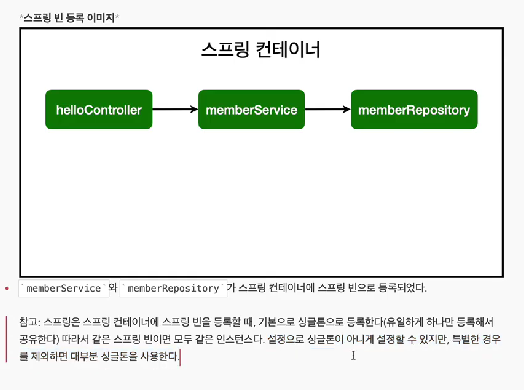

```java
@Controller
public class MemberController {
    private final MemberService memberService;

    @Autowired
    public MemberController(MemberService memberService){
        this.memberService = memberService;
    }

}
```


## 자바 코드로 직접 스프링 빈 등록하기

- 회원 서비스와 회원 리보지토리의 `@Service`, `@Repository`, `@Autowired` 애노테이션을 제거하고 진행한다.

```java
//service/SpringConfig

package hello.hellospring.service;

import hello.hellospring.repository.MemberRepository;
import hello.hellospring.repository.MemoryMemberRepository;
import org.springframework.context.annotation.Bean;
import org.springframework.context.annotation.Configuration;

@Configuration
public class SpringConfig {

    @Bean
    public MemberService memberService(){
        return new MemberService(memberRepository());
    }

    @Bean
    public MemberRepository memberRepository(){
        return new MemoryMemberRepository();
    }
}

```


- 참고 : DI에는 필드 주입 setter 주입, 생성자 주입 이렇게 3가지 방법이 있다 의존관계가 실행중에 동적으로 변하는 경우는 거의 없으므로 생성자 주입을 권장한다.
- 참고 : 실무에서는 주로 정형화된 컨트롤러, 서비스, 리포지토리 같은 코드는 컴포넌트 스캔을 사용한다. 그리고 정형화 되지 않거나, 상황에 따라 구현 클래스를 변경해야 하면 설정을 통해 스프링 빈으로 등록한다.
- 주의 : `@Autowired`를 통한 DI 는 `helloController`, `MemberService`등과 같이 스프링이 관리하는 객체에서만 동작한다. 스프링 빈으로 등록하지 않고 내가 직접 생성한 객체에서는 동작하지 않는다.
- 스프링 컨테이너, DI 관련된 자세한 내용은 스프링 핵심 원리 강의에서 설명한다.


## 회원관리 예제 - 웹 MVC 개발

- 회원 웹기능 -홈 화면 추가
- 회원 웹기능 - 등록
- 회원 웹기능 - 조회


### 회원 웹 기능 - 홈화면 추가

- 홈 컨트롤러 추가

```html
/home.html

<!doctype html>
<html xmlns:th="http://www.tymeleaf.org">
<body>

<div class="container">
  <div>
    <h1>hello Spring</h1>
    <p>회원기능</p>
    <p>
      <a href="/members/new">회원 가입</a>
      <a href="/members">회원 목록</a>
    </p>
  </div>

</div>
</body>
</html>
```

```java
package hello.hellospring.controller;


import hello.hellospring.domain.Member;
import hello.hellospring.domain.service.MemberService;
import org.springframework.beans.factory.annotation.Autowired;
import org.springframework.stereotype.Controller;
import org.springframework.web.bind.annotation.GetMapping;
import org.springframework.web.bind.annotation.PostMapping;

@Controller
public class MemberController {
    private final MemberService memberService;

    @Autowired
    public MemberController(MemberService memberService){
        this.memberService = memberService;
    }

    @GetMapping("/members/new")
    public String createForm(){
        return "members/createMemberForm";
    }

    @PostMapping("/members/new")
    public String create(MemberForm form){
        Member member = new Member();
        member.setName(form.getName());

        memberService.join(member);

        return "redirect:/";
    }

}

```


## 17 회원 웹기능 조회

### 회원 컨트롤러에서 조회 기능

```java
    @GetMapping("/members")
    public String list(Model model){
        List<Member> members = memberService.findMembers();
        model.addAttribute("members", members);
        return "members/memberList";
    }
```

### 회원 리스트 HTML

```html
<!doctype html>
<html xmlns:th="http://www.tymeleaf.org">
<body>

<div class="container">
    <div>
        <table>
            <thead>
            <tr>
                <th>#</th>
                <th>이름</th>
            </tr>
            </thead>
            <tbody>
            <tr th:each="member : ${members}">
                <td th:text="${member.id}"></td>
                <td th:text="${member.name}"></td>
            </tr>
            </tbody>

        </table>
    </div>

</div>
</body>
</html>
```


# 0630

https://www.youtube.com/watch?v=9sdqLgVbskg&list=PLumVmq_uRGHgBrimIp2-7MCnoPUskVMnd&index=21

## 18 h2 데이터 베이스 설치

## 스프링 DB 접근 기술

### 스프링 데이터 엑세스

- H2 데이터베이스 설치
- 순수 jdbc
- 스프링 jdbc Template
- JPA
- 스프링데이터 JPA

## h2데이터 베이스 설치

- 개발이나 테스트 용도로 가볍고 편리한 DB, 웹 화면 제공

```sql
drop table if exists member CASCADE;
create table member
(
 id bigint generated by default as identity, //nul 값인 경우 db가 알아서 id를 채워줌
 name varchar(255),
 primary key (id)
);
```

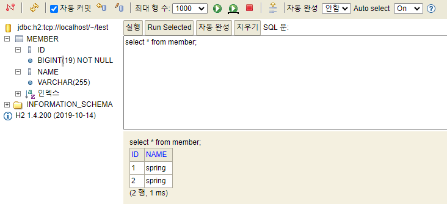


## 19 jdbc

## 20 스프링 통합 테스트

- db까지 실제 연결

```java
import org.springframework.transaction.annotation.Transactional;
```

- 이게 참조가 안된다
- 오류해결방법
- 1.

```java
implementation 'org.springframework.boot:spring-boot-starter-jdbc'
runtimeOnly 'com.h2database:h2'
```

- bulid.grale에 해당항목을 dependencies에 넣어준다.


- 2. main/resources/application.properties에서

```java
spring.datasource.url=jdbc:h2:tcp://localhost/~/test
spring.datasource.driver-class-name=org.h2.Driver
spring.datasource.username=sa

```

추가해준다.


- @SpringBootTest : 스프링 컨테이너와 테스트를 함께 실행한다. 

- @Transactional : 테스트 케이스에 이 애노테이션이 있으면, 테스트 시작 전에 트랜잭션을 시작하고,  테스트 완료 후에 항상 롤백한다. 이렇게 하면 DB에 데이터가 남지 않으므로 다음 테스트에 영향을 주지 않는다


## 21 jdbctemplate

## 22 jpa

- 꼭 h2를 켜놓아야한다.
- 그리고 applications.propertites에서

```java
spring.datasource.url=jdbc:h2:tcp://localhost/~/test
spring.datasource.driver-class-name=org.h2.Driver
spring.jpa.show-sql=true
spring.datasource.username=sa
spring.jpa.hibernate.ddl-auto=none
```

을 잊지말고 넣어주도록 하자


@commit을 넣어야 테스트케이스 실행할때 h2 db에서 확인할 수 있다. 아닌경우 자동으로 롤백됨


# 0631

# AOP 필요

## 로그인 시간을 찍어보라

- service/memverservice

```java
    public Long join(Member member){
        //중복회원 x
        
        long start = System.currentTimeMillis();
        try{
            validateDuplicateMember(member); //중복회원 검증
            memberRepository.save(member);
            return member.getId();
        }finally {
            long finish = System.currentTimeMillis();
            long timeMs = finish -start;
            System.out.println("join = " + timeMs + "ms");
        }


    }


   /**전체회원 조회**/
    public List<Member> findMembers(){
        long start = System.currentTimeMillis();
        try{
            return memberRepository.findAll();
        }finally {
            long finish = System.currentTimeMillis();
            long timeMs = finish -start;
            System.out.println("findMembers = " +timeMs + "ms");
        }

```

- 이러면 유지보수 관리하기가 힘들다

## 25AOP적용

- spring.config에서

```java
//    @Bean
//    public TimeTraceAop timeTraceAop(){
//        return new TimeTraceAop();
//    }
```

- 이걸 쓰거나

```java
@Aspect
@Component //Bean이랑 같은기능?


public class TimeTraceAop {
    @Around("execution(* hello.hellospring..*(..))")
    public Object execute(ProceedingJoinPoint joinPoint) throws Throwable{
        long start = System.currentTimeMillis();
        System.out.println("Start = " + joinPoint.toString());
        try{
            Object result = joinPoint.proceed();
            return result;
        }finally {
            long finish = System.currentTimeMillis();
            long timeMs = finish-start;
            System.out.println("END = " + joinPoint.toString() +" "+ timeMs+ "ms");

        }
```


- TimeTraceAop에서 컴포넌트를 붙여주면 된다.
  - ` @Around("execution(* hello.hellospring..*(..))")` 타게팅 해줘야함
